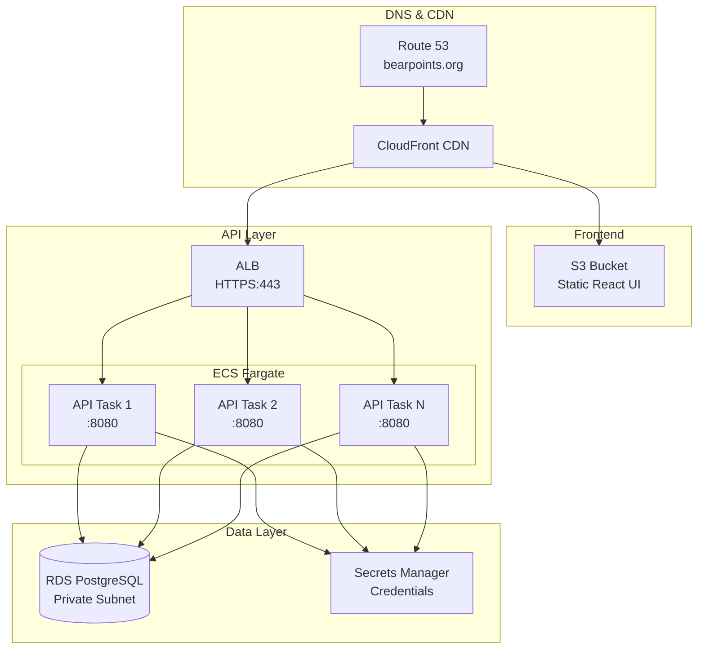

# BearPoints - AWS Deployment Guide

[]()
[]()
[]()
[]()

This document provides complete infrastructure setup and deployment instructions for the BearPoints application on AWS.

**Live Production:** [https://bearpoints.org](https://bearpoints.org)

---

## 📋 Prerequisites

- AWS account with administrative access
- Domain name (bearpoints.org) managed by Route 53
- SSL certificate in AWS Certificate Manager (ACM)
- GitHub repository with GitHub Actions enabled
- AWS CLI installed and configured locally
- Docker installed locally

---

## 🏗️ Architecture Overview



---

## 📦 Infrastructure Components

### 1. VPC Configuration

Create a VPC with public and private subnets across two availability zones.

| Component | Configuration |
|-----------|---------------|
| VPC CIDR | `10.0.0.0/16` |
| Public Subnets | `10.0.1.0/24` (AZ1), `10.0.2.0/24` (AZ2) |
| Private Subnets | `10.0.3.0/24` (AZ1), `10.0.4.0/24` (AZ2) |
| NAT Gateway | For private subnet internet access |
| Internet Gateway | For public subnets |

### 2. RDS PostgreSQL

```bash
# Create RDS subnet group
aws rds create-db-subnet-group \
    --db-subnet-group-name bearpoints-subnet-group \
    --subnet-ids subnet-private-1 subnet-private-2 \
    --db-subnet-group-description "BearPoints RDS subnet group"

# Create RDS instance
aws rds create-db-instance \
    --db-instance-identifier bearpoints-db \
    --db-instance-class db.t3.micro \
    --engine postgres \
    --engine-version 15 \
    --master-username bearpoints \
    --master-user-password <secure-password> \
    --allocated-storage 20 \
    --storage-type gp3 \
    --vpc-security-group-ids sg-xxx \
    --db-subnet-group-name bearpoints-subnet-group \
    --no-publicly-accessible \
    --backup-retention-period 7 \
    --backup-window "03:00-04:00" \
    --maintenance-window "sun:04:00-sun:05:00"
```

#### Security Group Rules:

| Type | Port | Source | Purpose |
|------|------|--------|---------|
| PostgreSQL | 5432 | ECS Security Group | Allow API access |
| PostgreSQL | 5432 | Bastion (optional) | Admin access |

### 3. ECR Repository

```bash
# Create ECR repository
aws ecr create-repository \
    --repository-name bearpoints-api \
    --image-scanning-configuration scanOnPush=true \
    --region us-east-2

# Login to ECR
aws ecr get-login-password --region us-east-2 | \
    docker login --username AWS --password-stdin <account-id>.dkr.ecr.us-east-2.amazonaws.com

# Build and push initial image
cd api
docker build -t bearpoints-api .
docker tag bearpoints-api:latest <account-id>.dkr.ecr.us-east-2.amazonaws.com/bearpoints-api:latest
docker push <account-id>.dkr.ecr.us-east-2.amazonaws.com/bearpoints-api:latest
```

### 4. ECS Cluster & Task Definition

**Task Definition:** `task-definition.json`

```json
{
  "family": "bearpoints-api",
  "taskRoleArn": "arn:aws:iam::<account-id>:role/ecsTaskRole",
  "executionRoleArn": "arn:aws:iam::<account-id>:role/ecsExecutionRole",
  "networkMode": "awsvpc",
  "requiresCompatibilities": ["FARGATE"],
  "cpu": "512",
  "memory": "1024",
  "containerDefinitions": [
    {
      "name": "bearpoints-api",
      "image": "<account-id>.dkr.ecr.us-east-2.amazonaws.com/bearpoints-api:latest",
      "portMappings": [
        {
          "containerPort": 8080,
          "protocol": "tcp"
        }
      ],
      "environment": [
        {"name": "DB_HOST", "value": "bearpoints-db.xxxxxx.us-east-2.rds.amazonaws.com"},
        {"name": "DB_PORT", "value": "5432"},
        {"name": "DB_NAME", "value": "bearpoints"},
        {"name": "DB_USERNAME", "value": "bearpoints"},
        {"name": "GOOGLE_SHEET_ID", "value": "<your-sheet-id>"},
        {"name": "SHOW_SQL", "value": "false"},
        {"name": "PORT", "value": "8080"}
      ],
      "secrets": [
        {"name": "DB_PASSWORD", "valueFrom": "arn:aws:secretsmanager:<region>:<account-id>:secret:bearpoints/db-password"},
        {"name": "GOOGLE_SERVICE_ACCOUNT_KEY", "valueFrom": "arn:aws:secretsmanager:<region>:<account-id>:secret:bearpoints/google-key"},
        {"name": "FIREBASE_SERVICE_ACCOUNT_KEY", "valueFrom": "arn:aws:secretsmanager:<region>:<account-id>:secret:bearpoints/firebase-key"},
        {"name": "FIREBASE_AUTH_DOMAIN", "valueFrom": "arn:aws:secretsmanager:<region>:<account-id>:secret:bearpoints/firebase-auth-domain"}
      ],
      "logConfiguration": {
        "logDriver": "awslogs",
        "options": {
          "awslogs-group": "/ecs/bearpoints-api",
          "awslogs-region": "us-east-2",
          "awslogs-stream-prefix": "ecs"
        }
      },
      "healthCheck": {
        "command": ["CMD-SHELL", "wget --quiet --tries=1 --spider http://localhost:8080/actuator/health || exit 1"],
        "interval": 30,
        "timeout": 5,
        "retries": 3,
        "startPeriod": 60
      }
    }
  ]
}
```

```bash
# Register task definition
aws ecs register-task-definition --cli-input-json file://task-definition.json

# Create ECS cluster
aws ecs create-cluster --cluster-name bearpoints-cluster

# Create ECS service
aws ecs create-service \
    --cluster bearpoints-cluster \
    --service-name bearpoints-service \
    --task-definition bearpoints-api \
    --desired-count 2 \
    --launch-type FARGATE \
    --platform-version LATEST \
    --network-configuration '{
        "awsvpcConfiguration": {
            "subnets": ["subnet-private-1", "subnet-private-2"],
            "securityGroups": ["sg-ecs-xxx"],
            "assignPublicIp": "DISABLED"
        }
    }' \
    --load-balancers '[
        {
            "targetGroupArn": "arn:aws:elasticloadbalancing:<region>:<account-id>:targetgroup/bearpoints-tg/xxx",
            "containerName": "bearpoints-api",
            "containerPort": 8080
        }
    ]'
```

### 5. Application Load Balancer (ALB)

```bash
# Create target group
aws elbv2 create-target-group \
    --name bearpoints-tg \
    --protocol HTTP \
    --port 8080 \
    --vpc-id vpc-xxx \
    --health-check-path /actuator/health \
    --health-check-interval-seconds 30 \
    --healthy-threshold-count 2 \
    --unhealthy-threshold-count 2

# Create load balancer
aws elbv2 create-load-balancer \
    --name bearpoints-alb \
    --subnets subnet-public-1 subnet-public-2 \
    --security-groups sg-alb-xxx \
    --scheme internet-facing \
    --type application

# Create HTTPS listener
aws elbv2 create-listener \
    --load-balancer-arn arn:aws:elasticloadbalancing:<region>:<account-id>:loadbalancer/app/bearpoints-alb/xxx \
    --protocol HTTPS \
    --port 443 \
    --certificates CertificateArn=arn:aws:acm:<region>:<account-id>:certificate/xxx \
    --default-actions Type=forward,TargetGroupArn=arn:aws:elasticloadbalancing:<region>:<account-id>:targetgroup/bearpoints-tg/xxx 

# Create HTTP to HTTPS redirect listener
aws elbv2 create-listener \
    --load-balancer-arn arn:aws:elasticloadbalancing:<region>:<account-id>:loadbalancer/app/bearpoints-alb/xxx \
    --protocol HTTP \
    --port 80 \
    --default-actions Type=redirect,RedirectConfig="Protocol=HTTPS,Port=443,StatusCode=HTTP_301"
```

### 6. S3 Bucket (Frontend)

```bash
# Create S3 bucket
aws s3 mb s3://bearpoints-ui --region us-east-2

# Enable static website hosting
aws s3 website s3://bearpoints-ui/ \
    --index-document index.html \
    --error-document index.html

# Set bucket policy for public read access
aws s3api put-bucket-policy --bucket bearpoints-ui --policy '{
    "Version": "2012-10-17",
    "Statement": [
        {
            "Effect": "Allow",
            "Principal": "*",
            "Action": "s3:GetObject",
            "Resource": "arn:aws:s3:::bearpoints-ui/*"
        }
    ]
}'

# Configure CORS
aws s3api put-bucket-cors --bucket bearpoints-ui --cors-configuration '{
    "CORSRules": [
        {
            "AllowedOrigins": ["https://bearpoints.org"],
            "AllowedMethods": ["GET", "HEAD"],
            "AllowedHeaders": ["*"],
            "MaxAgeSeconds": 3000
        }
    ]
}'
```

### 7. CloudFront Distribution

```bash
# Create CloudFront distribution
aws cloudfront create-distribution \
    --origin-domain-name bearpoints-ui.s3.us-east-2.amazonaws.com \
    --default-root-object index.html \
    --viewer-protocol-policy redirect-to-https \
    --aliases bearpoints.org \
    --default-cache-behavior '{
        "TargetOriginId": "S3-bearpoints-ui",
        "ViewerProtocolPolicy": "redirect-to-https",
        "MinTTL": 0,
        "DefaultTTL": 3600,
        "MaxTTL": 86400,
        "Compress": true,
        "ForwardedValues": {
            "QueryString": true,
            "Cookies": {"Forward": "none"}
        }
    }' \
    --price-class PriceClass_100 \
    --enabled
```

#### Custom Error Responses:

| Error Code | Response Page | Response Code |
|------------|---------------|---------------|
| 403 | /index.html | 200 |
| 404 | /index.html | 200 |

### 8. Route 53 DNS

```bash
# Create A record pointing to CloudFront
aws route53 change-resource-record-sets --hosted-zone-id <zone-id> --change-batch '{
  "Changes": [
    {
      "Action": "UPSERT",
      "ResourceRecordSet": {
        "Name": "bearpoints.org",
        "Type": "A",
        "AliasTarget": {
          "HostedZoneId": "Z2FDTNDATAQYW2",
          "DNSName": "<cloudfront-distribution>.cloudfront.net",
          "EvaluateTargetHealth": false
        }
      }
    },
    {
      "Action": "UPSERT",
      "ResourceRecordSet": {
        "Name": "api.bearpoints.org",
        "Type": "A",
        "AliasTarget": {
          "HostedZoneId": "<alb-hosted-zone-id>",
          "DNSName": "<alb-dns-name>",
          "EvaluateTargetHealth": true
        }
      }
    }
  ]
}'
```

### 9. Secrets Manager

```bash
# Store database password
aws secretsmanager create-secret \
    --name bearpoints/db-password \
    --secret-string "your-postgres-password"

# Store Google service account key
aws secretsmanager create-secret \
    --name bearpoints/google-key \
    --secret-string '{"type":"service_account","project_id":"...","private_key":"...",...}'

# Store Firebase service account key
aws secretsmanager create-secret \
    --name bearpoints/firebase-key \
    --secret-string '{"type":"service_account","project_id":"...","private_key":"...",...}'

# Store Firebase auth domain
aws secretsmanager create-secret \
    --name bearpoints/firebase-auth-domain \
    --secret-string "your-project.firebaseapp.com"
```

---

## 🔐 IAM Roles

### ECS Task Role (`ecsTaskRole`)

```json
{
  "Version": "2012-10-17",
  "Statement": [
    {
      "Effect": "Allow",
      "Action": [
        "secretsmanager:GetSecretValue",
        "logs:CreateLogGroup",
        "logs:CreateLogStream",
        "logs:PutLogEvents"
      ],
      "Resource": "*"
    }
  ]
}
```


### ECS Execution Role (`ecsExecutionRole`)

```json
{
  "Version": "2012-10-17",
  "Statement": [
    {
      "Effect": "Allow",
      "Action": [
        "ecr:GetAuthorizationToken",
        "ecr:BatchCheckLayerAvailability",
        "ecr:GetDownloadUrlForLayer",
        "ecr:BatchGetImage",
        "logs:CreateLogStream",
        "logs:PutLogEvents"
      ],
      "Resource": "*"
    }
  ]
}
```

### GitHub Actions OIDC Role

```json
{
  "Version": "2012-10-17",
  "Statement": [
    {
      "Effect": "Allow",
      "Action": [
        "ecr:GetAuthorizationToken",
        "ecr:UploadLayerPart",
        "ecr:CompleteLayerUpload",
        "ecr:InitiateLayerUpload",
        "ecr:BatchCheckLayerAvailability",
        "ecr:PutImage"
      ],
      "Resource": "*"
    },
    {
      "Effect": "Allow",
      "Action": [
        "ecs:UpdateService",
        "ecs:DescribeServices"
      ],
      "Resource": "arn:aws:ecs:*:*:service/bearpoints-cluster/bearpoints-service"
    },
    {
      "Effect": "Allow",
      "Action": [
        "s3:PutObject",
        "s3:DeleteObject",
        "s3:ListBucket"
      ],
      "Resource": [
        "arn:aws:s3:::bearpoints-ui",
        "arn:aws:s3:::bearpoints-ui/*"
      ]
    },
    {
      "Effect": "Allow",
      "Action": "cloudfront:CreateInvalidation",
      "Resource": "*"
    }
  ]
}
```

---

## 🔄 CI/CD Pipeline (GitHub Actions)

### Workflow File: `.github/workflows/deploy.yml`

```yml
name: Deploy to Production

on:
  push:
    branches: [main]

env:
  AWS_REGION: us-east-2
  ECR_REPOSITORY: bearpoints-api
  ECS_CLUSTER: bearpoints-cluster
  ECS_SERVICE: bearpoints-service
  ECS_TASK_DEFINITION: api/task-definition.json
  S3_BUCKET: bearpoints-ui
  CLOUDFRONT_DISTRIBUTION_ID: ${{ secrets.CLOUDFRONT_DISTRIBUTION_ID }}

jobs:
  deploy:
    name: Deploy API + UI
    runs-on: ubuntu-latest
    permissions:
      id-token: write
      contents: read

    steps:
      - uses: actions/checkout@v4

      # Backend: Build & Push to ECR
      - name: Setup Java
        uses: actions/setup-java@v4
        with:
          java-version: '24'
          distribution: 'temurin'

      - name: Build JAR
        run: cd api && mvn clean package -DskipTests

      - name: Configure AWS credentials
        uses: aws-actions/configure-aws-credentials@v4
        with:
          role-to-assume: ${{ secrets.AWS_ROLE_ARN }}
          aws-region: ${{ env.AWS_REGION }}

      - name: Login to Amazon ECR
        id: login-ecr
        uses: aws-actions/amazon-ecr-login@v2

      - name: Build, tag, and push image to Amazon ECR
        env:
          REGISTRY: ${{ steps.login-ecr.outputs.registry }}
          IMAGE_TAG: ${{ github.sha }}
        run: |
          docker build -t $REGISTRY/$ECR_REPOSITORY:$IMAGE_TAG ./api
          docker tag $REGISTRY/$ECR_REPOSITORY:$IMAGE_TAG $REGISTRY/$ECR_REPOSITORY:latest
          docker push $REGISTRY/$ECR_REPOSITORY:$IMAGE_TAG
          docker push $REGISTRY/$ECR_REPOSITORY:latest

      - name: Force ECS deployment
        run: |
          aws ecs update-service --cluster $ECS_CLUSTER --service $ECS_SERVICE --force-new-deployment

      # Frontend: Build & Deploy to S3 + CloudFront
      - name: Setup Node
        uses: actions/setup-node@v4
        with:
          node-version: '22'
          cache: 'npm'
          cache-dependency-path: 'ui/package-lock.json'

      - name: Install dependencies
        run: cd ui && npm ci

      - name: Build React app
        run: |
          cd ui
          VITE_API_URL=https://api.bearpoints.org \
          VITE_FIREBASE_API_KEY=${{ secrets.VITE_FIREBASE_API_KEY }} \
          VITE_FIREBASE_AUTH_DOMAIN=${{ secrets.VITE_FIREBASE_AUTH_DOMAIN }} \
          VITE_FIREBASE_PROJECT_ID=${{ secrets.VITE_FIREBASE_PROJECT_ID }} \
          VITE_FIREBASE_STORAGE_BUCKET=${{ secrets.VITE_FIREBASE_STORAGE_BUCKET }} \
          VITE_FIREBASE_MESSAGING_SENDER_ID=${{ secrets.VITE_FIREBASE_MESSAGING_SENDER_ID }} \
          VITE_FIREBASE_APP_ID=${{ secrets.VITE_FIREBASE_APP_ID }} \
          npm run build

      - name: Sync to S3
        run: aws s3 sync ./ui/dist/ s3://${{ env.S3_BUCKET }}/ --delete

      - name: Invalidate CloudFront cache
        run: |
          aws cloudfront create-invalidation \
            --distribution-id ${{ env.CLOUDFRONT_DISTRIBUTION_ID }} \
            --paths "/*"
```

### GitHub Secrets Required

| Secret Name | Description |
|-------------|-------------|
| `AWS_ROLE_ARN` | IAM role ARN for OIDC authentication |
| `CLOUDFRONT_DISTRIBUTION_ID` | CloudFront distribution ID |
| `VITE_FIREBASE_API_KEY` | Firebase web API key |
| `VITE_FIREBASE_AUTH_DOMAIN` | Firebase auth domain |
| `VITE_FIREBASE_PROJECT_ID` | Firebase project ID |
| `VITE_FIREBASE_STORAGE_BUCKET` | Firebase storage bucket |
| `VITE_FIREBASE_MESSAGING_SENDER_ID` | Firebase sender ID |
| `VITE_FIREBASE_APP_ID` | Firebase app ID |

---

## 📊 Monitoring & Alerting

### CloudWatch Log Groups

```bash
# Create log group for ECS
aws logs create-log-group --log-group-name /ecs/bearpoints-api

# Set retention (30 days)
aws logs put-retention-policy \
    --log-group-name /ecs/bearpoints-api \
    --retention-in-days 30
```

### CloudWatch Alarms

```bash
# High CPU alarm
aws cloudwatch put-metric-alarm \
    --alarm-name bearpoints-high-cpu \
    --alarm-description "ALARM when CPU > 80%" \
    --metric-name CPUUtilization \
    --namespace AWS/ECS \
    --statistic Average \
    --period 300 \
    --evaluation-periods 2 \
    --threshold 80 \
    --comparison-operator GreaterThanThreshold \
    --dimensions Name=ClusterName,Value=bearpoints-cluster Name=ServiceName,Value=bearpoints-service

# High 5xx error rate
aws cloudwatch put-metric-alarm \
    --alarm-name bearpoints-high-5xx \
    --alarm-description "ALARM when 5xx rate > 1%" \
    --metric-name HTTPCode_Target_5XX_Count \
    --namespace AWS/ApplicationELB \
    --statistic Sum \
    --period 300 \
    --evaluation-periods 2 \
    --threshold 5 \
    --comparison-operator GreaterThanThreshold \
    --dimensions Name=LoadBalancer,Value=bearpoints-alb Name=TargetGroup,Value=bearpoints-tg
```

---

## 🔄 Maintenance Procedures

### Deploy API Only

```bash
# Build and push new image
docker build -t bearpoints-api ./api
docker tag bearpoints-api:latest <account-id>.dkr.ecr.us-east-2.amazonaws.com/bearpoints-api:latest
docker push <account-id>.dkr.ecr.us-east-2.amazonaws.com/bearpoints-api:latest

# Force ECS deployment
aws ecs update-service --cluster bearpoints-cluster --service bearpoints-service --force-new-deployment
```

### Deploy Frontend Only

```bash
# Build React app
cd ui
npm run build

# Sync to S3
aws s3 sync ./dist/ s3://bearpoints-ui/ --delete

# Invalidate CloudFront
aws cloudfront create-invalidation --distribution-id <distribution-id> --paths "/*"
```

### Database Backup

```bash
# Create manual snapshot
aws rds create-db-snapshot \
    --db-instance-identifier bearpoints-db \
    --db-snapshot-identifier bearpoints-db-backup-$(date +%Y%m%d)

# List snapshots
aws rds describe-db-snapshots --db-instance-identifier bearpoints-db
```

### Restore Database from Snapshot

```bash
# Restore from snapshot
aws rds restore-db-instance-from-db-snapshot \
    --db-instance-identifier bearpoints-db-restored \
    --db-snapshot-identifier bearpoints-db-backup-20241201
```

---

## 🚨 Rollback Procedures

### Rollback API

```bash
# List previous task definitions
aws ecs list-task-definitions --family-prefix bearpoints-api --sort DESC

# Update service to previous revision
aws ecs update-service \
    --cluster bearpoints-cluster \
    --service bearpoints-service \
    --task-definition bearpoints-api:<previous-revision>
```

### Rollback Frontend

```bash
# Restore from S3 version (if versioning enabled)
aws s3api restore-object \
    --bucket bearpoints-ui \
    --key index.html \
    --version-id <version-id>

# Or sync from backup
aws s3 sync s3://bearpoints-ui-backup/ s3://bearpoints-ui/

# Invalidate CloudFront cache
aws cloudfront create-invalidation --distribution-id <distribution-id> --paths "/*"
```

### Rollback RDS

```bash
# Restore from snapshot to new instance
aws rds restore-db-instance-from-db-snapshot \
    --db-instance-identifier bearpoints-db-restored \
    --db-snapshot-identifier bearpoints-db-backup-20241201

# Update ECS environment variable to point to restored DB
# Then redeploy API
```

---

## 📈 Scaling Configuration

### ECS Service Auto Scaling

```bash
# Register scalable target
aws application-autoscaling register-scalable-target \
    --service-namespace ecs \
    --scalable-dimension ecs:service:DesiredCount \
    --resource-id service/bearpoints-cluster/bearpoints-service \
    --min-capacity 2 \
    --max-capacity 10

# Create scale-out policy (CPU)
aws application-autoscaling put-scaling-policy \
    --service-namespace ecs \
    --scalable-dimension ecs:service:DesiredCount \
    --resource-id service/bearpoints-cluster/bearpoints-service \
    --policy-name bearpoints-cpu-scale-out \
    --policy-type TargetTrackingScaling \
    --target-tracking-scaling-policy-configuration '{
        "TargetValue": 80.0,
        "PredefinedMetricSpecification": {
            "PredefinedMetricType": "ECSServiceAverageCPUUtilization"
        }
    }'
```

---

## 🔒 Security Checklist

- VPC with private subnets for RDS
- Security groups with minimum ports
- RDS not publicly accessible
- Secrets Manager for all credentials
- SSL/TLS for all endpoints (ACM)
- CloudFront with HTTPS only
- S3 bucket with proper CORS policy
- IAM roles with least privilege
- CloudTrail enabled for audit logging
- WAF rules for DDoS protection (recommended)
- Regular security patching schedule
- Database automated backups enabled

---

## 📝 Troubleshooting

### ECS Tasks Failing to Start

```bash
# Check task logs
aws logs tail /ecs/bearpoints-api --follow

# Describe task failure
aws ecs describe-tasks --cluster bearpoints-cluster --tasks <task-id>

# Check task definition
aws ecs describe-task-definition --task-definition bearpoints-api
```

### Database Connection Issues

```bash
# Test connection from within VPC
aws ecs execute-command --cluster bearpoints-cluster --task <task-id> --container bearpoints-api --interactive --command "nc -zv <rds-endpoint> 5432"

# Check RDS security group
aws ec2 describe-security-groups --group-ids <sg-id>

# Verify RDS is in same VPC as ECS
aws rds describe-db-instances --db-instance-identifier bearpoints-db
```

### CloudFront Not Updating

```bash
# Check invalidation status
aws cloudfront list-invalidations --distribution-id <distribution-id> --max-items 5

# Create new invalidation
aws cloudfront create-invalidation --distribution-id <distribution-id> --paths "/*"

# Verify S3 bucket has correct files
aws s3 ls s3://bearpoints-ui/ --recursive
```

---

## 📚 Related Documentation

| Document | Location |
|----------|----------|
| Root README | `/README.md` |
| API Documentation | `/api/README.md` |
| Frontend Documentation | `/ui/README.md` |

---

## 👥 Team

- **Dylan Mercer** - Lead Developer

---

**Built with ☕ and 🐻 on AWS**
