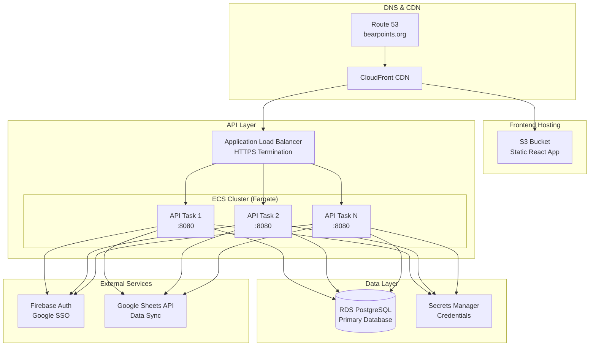
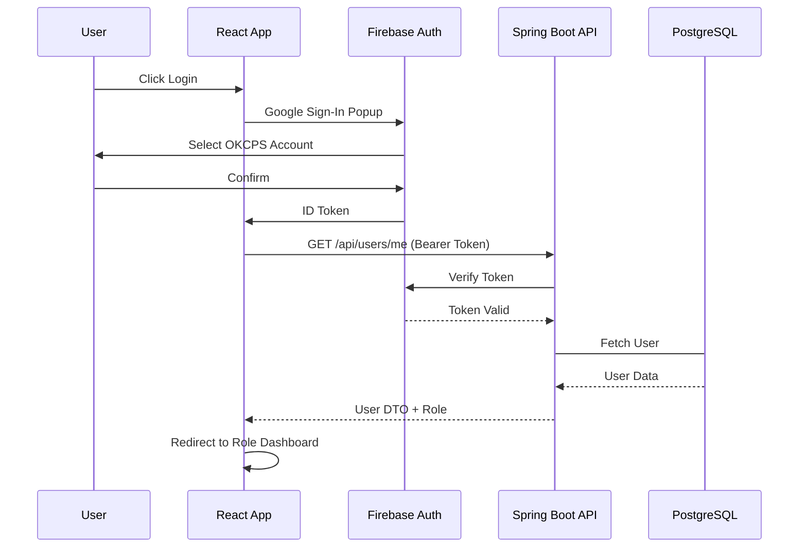
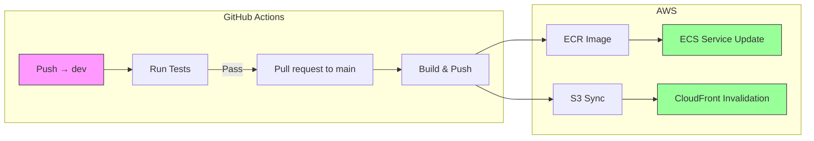
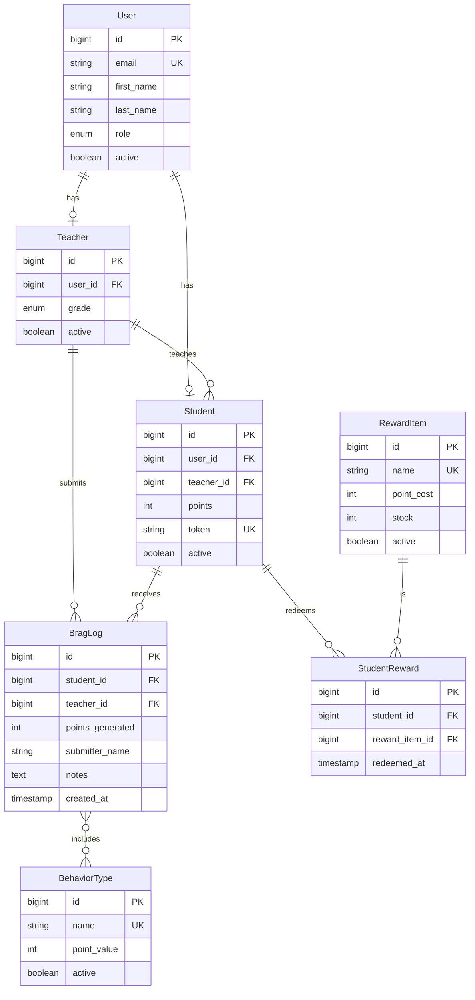
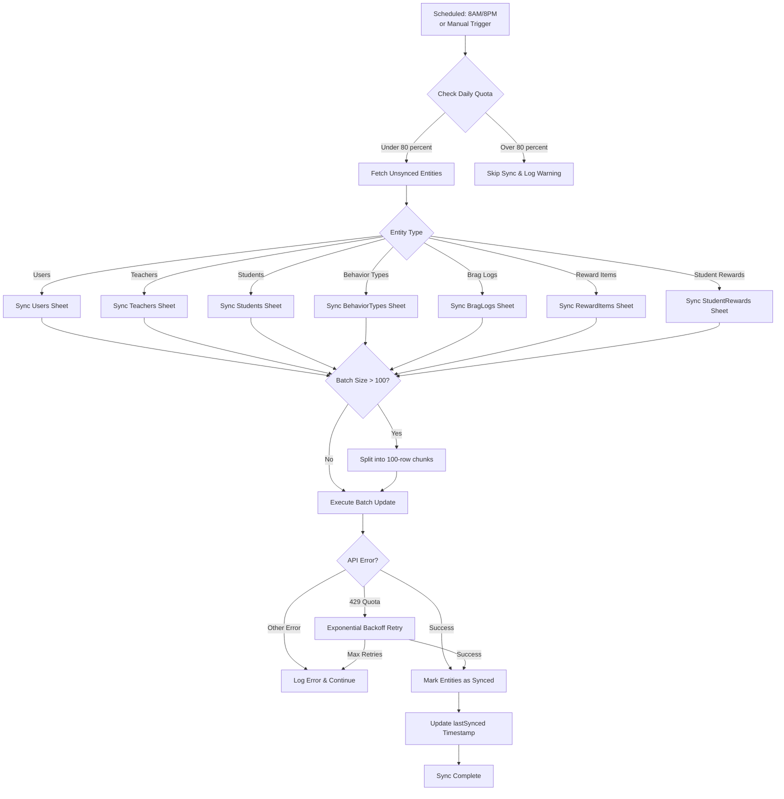

# BearPoints - Student Recognition System

[]()
[]()
[]()
[]()
[]()

**BearPoints** is a production-grade student recognition and reward system for Buchanan Elementary School. Teachers and staff can recognize positive student behavior, track points, and manage rewards through role-based dashboards.

**Live Production:** [https://bearpoints.org](https://bearpoints.org)

---

## 🏗️ Production Architecture



## AWS Services in Production

| Service | Purpose | Status |
|---------|---------|--------|
| **Route53** | DNS management for bearpoints.org | ✅ Live |
| **CloudFront** | CDN for gloabl low-latency delivery | ✅ Live |
| **S3** | Static React hosting | ✅ Live |
| **ACM** | SSL/TLS certificates | ✅ Live |
| **ALB** | Load balancing & HTTPS termination | ✅ Live |
| **ECS (Fargate)** | Container orchestration | ✅ Live |
| **ECR** | Docker image registry | ✅ Live |
| **RDS (PostgreSQL)** | Primary application database | ✅ Live |
| **Secrets Manager** | Secure credential storage | ✅ Live |
| **VPC** | Isolated network environment | ✅ Live |

---

## 📁 Repository Structure

```
BearPoints/
├── api/ # Spring Boot backend
│ ├── src/
│ │ ├── main/java/ # Application code
│ │ └── test/ # Unit & integration tests
│ ├── Dockerfile
│ └── pom.xml
├── ui/ # React frontend
│ ├── src/
│ │ ├── components/ # Reusable UI components
│ │ ├── hooks/ # Custom React hooks
│ │ ├── pages/ # Route pages
│ │ ├── services/ # API client
│ │ ├── store/ # Redux state
│ │ └── utils/ # Helpers
│ ├── Dockerfile
│ └── package.json
├── .github/workflows/
│ ├── test.yml # PR validation
│ └── deploy.yml # Production deployment
├── docker-compose.yml # Local development
├── DEPLOY.md
└── README.md
```

--- 

## 🚀 Live Deployment Access

| Environment | URL | Description |
|-------------|-----|-------------|
| **Production** | https://bearpoints.org | Live application |
| **API** | https://api.bearpoints.org | REST API endpoint |
| **API Docs** | https://api.bearpoints.org/swagger-ui.html | Interactive API documentation |
| **Health Check** | https://api.bearpoints.org/actuator/health | Service health status |

---

## 👥 Role-Based Access

| Role | Dashboard | Permissions |
|------|-----------|-------------|
| **Admin** | Full system control | Create/Edit/Delete all entities, user management, Google Sheets sync |
| **Staff** | Management views | Create/Edit/Delete all entities, user management, Google Sheets sync |
| **Teacher** | Classroom focus | Manage own students, submit brag logs, classroom leaderboard |
| **Para** | Support role | Submit brag logs, view students |
| **Student** | Personal view | View points, rewards, leaderboards |

---

## 🔐 Authentication Flow



## 📊 Key Features

### For Teachers

- **Classroom Leaderboard** - Real-time points ranking with timeframe filters (Week/Month/Semester/Year)
- **Student Management** - Create, edit, and manage classroom rosters
- **Brag Logs** - Submit and track student recognition
- **QR Codes** - Print QR codes for quick brag submissions

### For Students

- **Points Dashboard** - View personal point total
- **Reward Store** - Redeem points for rewards
- **Achievement History** - Track brag logs and redeemed rewards
- **Classroom Leaderboard** - See ranking within class

### For Admins/Staff

- **User Management** - Create and manage ADMIN, STAFF, PARA users
- **Teacher Management** - Assign grade levels and manage teacher accounts
- **Behavior Types** - Configure point values and active status
- **Reward Items** - Manual inventory and point costs
- **System Sync** - Manual Google Sheets synchronization

### Data Synchronization

- **Automated Sync** - Runs daily at 8 AM and 8 PM
- **Manual Trigger** - Admin/Staff can sync on demand
- **Batch Processing** - 100 rows per batch with retry logic
- **Bidirectional** - Database ↔ Google Sheets

---

## 🛠️ Local Development

### Prerequisites

- Docker & Docker Compose
- Node.js 22+ (optional for local UI development)
- Java 24 JDK (optional for local API development)

### Quick Start with Docker Compose

```bash
# Clone the repository
git clone https://github.com/dmerc12/BearPoints.git
cd BearPoints

# Copy environment template
cp .env.example .env

# Edit .env with your configuration
# (Firebase keys, Google service account, etc.)

# Start all services
docker-compose up -d

# View logs
docker-compose logs -f
```

### Services Available
| Service | URL | Description |
|---------|-----|-------------|
| Frontend (Dev) | http://localhost:5173 | React development server |
| API | http://localhost:8080 | Spring Boot application |
| Database | localhost:5432 | PostgreSQL |

### Environment Variables

Create a `.env` file with:

```bash
# Test administratior
TEST_EMAIL='example@okcps.org'

# Database
DB_USERNAME='bearpoints'
DB_PASSWORD='bearpoints'
DB_NAME='bearpoints'
DB_HOST=localhost
DB_PORT=5432

# Show SQL in logs
SHOW_SQL=true

# Applicaiton port
PORT=8080

# Google
GOOGLE_SERVICE_ACCOUNT_KEY={"type": "service_account", ...}
GOOGLE_SHEET_ID='your-google-sheet-id'

# Firebase
FIREBASE_SERVICE_ACCOUNT_KEY={"type": "service_account", ...}
FIREBASE_WEB_API_KEY="your-api-key"
FIREBASE_AUTH_DOMAIN='your-auth-domain'

# Frontend (build time)
VITE_API_URL='http://localhost:8080/api'
VITE_FIREBASE_API_KEY='your-api-key'
VITE_FIREBASE_AUTH_DOMAIN='your-auth-domain'
VITE_FIREBASE_PROJECT_ID='your-project-id'
VITE_FIREBASE_STORAGE_BUCKET='your-storage-bucket'
VITE_FIREBASE_MESSAGING_SENDER_ID='your-sender-id'
VITE_FIREBASE_APP_ID='your-app-id'
```

---

## 🧪 Testing

```bash
# Backend tests (unit + integration with Testcontainers)
cd api
./mvnw clean verify
```

---

## 🚢 CI/CD Pipeline



### Deployment Triggers

| Branch | Trigger | Action |
|--------|---------|--------|
| `dev` | Push | Run tests only |
| `main` | Pull Request | Full Deployment (API + UI) |

---

## 📈 Monitoring & Health

### Health Endpoints

```bash
# API Health Check
curl https://api.bearpoints.org/actuator/health

## Expected response
{"status":"UP"}
```

### CloudWatch Monitoring
| Metric | Description | Alarm Threshold |
|--------|-------------|-----------------|
| CPUUtilization | ECS task CPU usage | >80% for 5 minutes |
| MemoryUtilization | ECS task memory usage | >85% for 5 minutes |
| DatabaseConnections | RDS connection count | >80% of max |
| HTTPCode_Target_5XX | ALB 5xx error rate | >1% for 5 minutes |

### Logging

| Log Source | Destination | Retention |
|------------|-------------|-----------|
| Application Logs | CloudWatch `/ecs/bearpoints-api` | 30 days |
| Access Logs | S3 (ALB logs) | 30 days |
| Database Logs | RDS Enhanced Monitoring | 7 days |

---

## 🔒 Security Compliance

| Control | Implementation |
|---------|----------------|
| Authentication | Firebase Auth with Google SSO |
| Authorization | Role-based access (5 roles) |
| Data in Transit | TLS 1.2+ (ACM + CloudFront + ALB) |
| Data at Rest | RDS encryption, Secrets Manager |
| Network Isolation | VPC with private subnets |
| Credential Management | AWS Secrets Manager |
| CORS | Restricted to [bearpoints.org](bearpoints.org) domains |
| Input Validation | Spring Validation + JPA constraints |
| SQL Injection | JPA/Hibernate parameterized queries |
| XSS Protection | React escaping + CSP headers |

---

## 📚 Documentation

| Document | Location | Description |
|----------|----------|-------------|
| API Documentaiton | `/api/README.md` | Backend setup and configuration |
| Frontend Documentation | `ui/README.md` | UI development and deployment |
| Deployment Guide | `DEPLOYMENT.md` | AWS infrastructure setup |
| API Swagger UI | [https://api.bearpoints.org/swagger-ui.html](https://api.bearpoints.org/swagger-ui.html) | Interactive API docs |

---

## 🗄️ Database Schema



---

## 🔄 Google Sheets Sync Process



---

## 📝 Release Notes

### Current Production Version: v1.0.0

#### Features:

- ✅ Role-based authentication (5 roles)
- ✅ QR code generation for students
- ✅ Public brag submission via QR scann
- ✅ Classroom leaderboards with timeframes
- ✅ Reward redemption system
- ✅ Google Sheets bidirectional sync
- ✅ Responsive Bootstrap UI

#### Infrastructure:

- ✅ Multi-AZ deployment
- ✅ Auto-scaling ECS tasks
- ✅ SSL/TLS everywhere
- ✅ CloudFront CDN
- ✅ Secrets Manager integration
- ✅ CI/CD via GitHub Actions

---

## 👥 Team

- **Dylan Mercer** - Lead Developer

---

## 📄 License

MIT License - See LICENSE file for details

---

## 🆘 Support

For issues or questions:
- Create a GitHub issue
- Contact the development team

---

**Built with ☕ and 🐻 at Buchanan Elementary**
