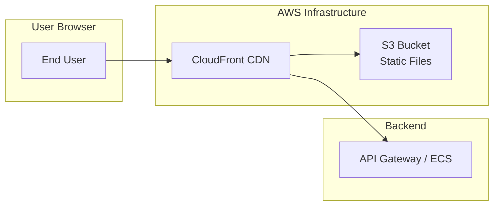
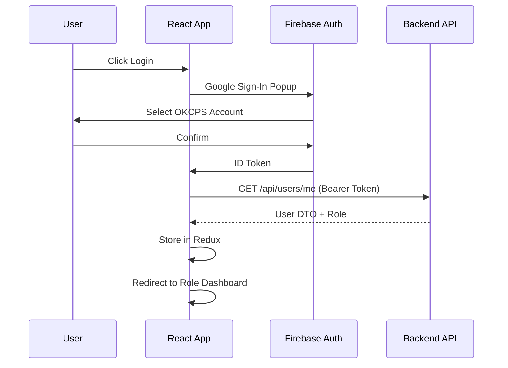
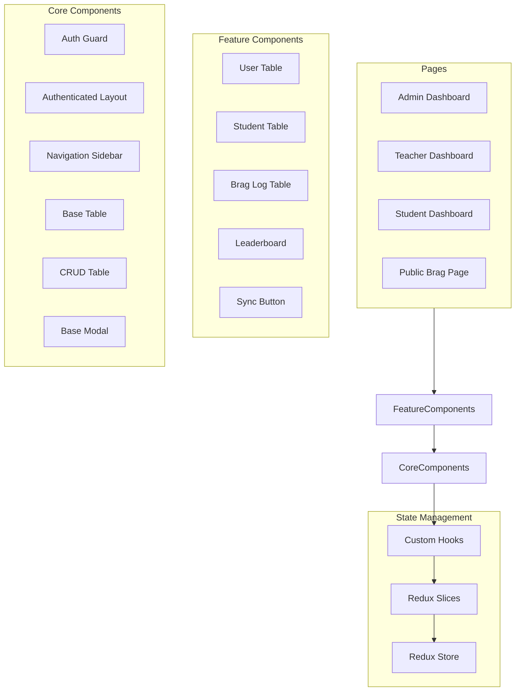
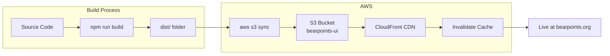
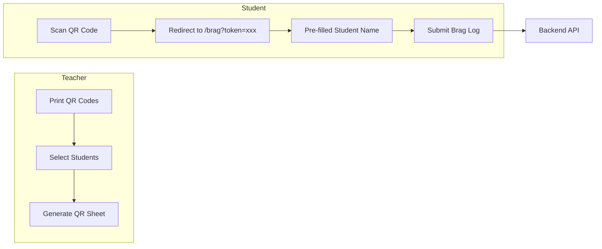
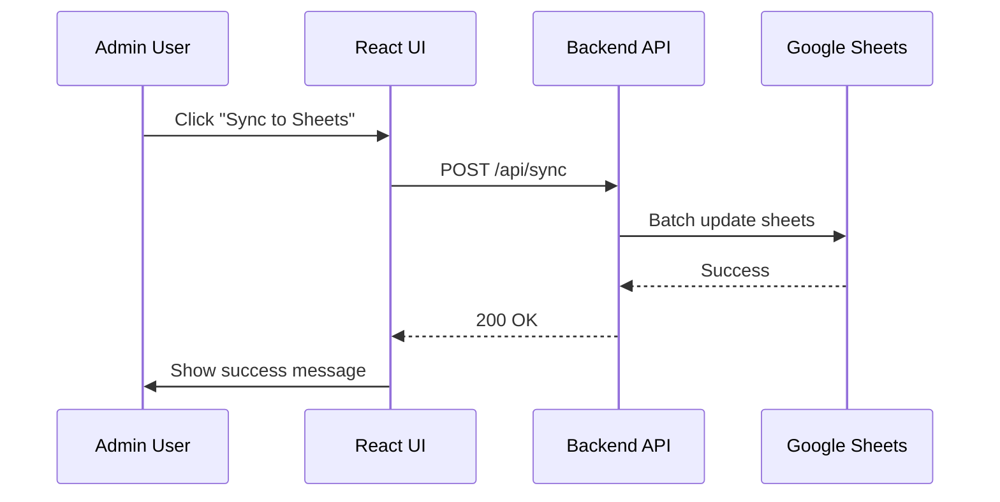
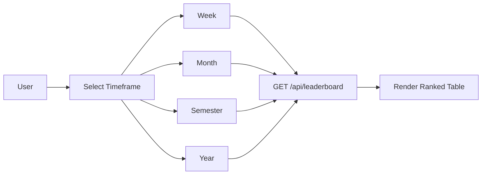
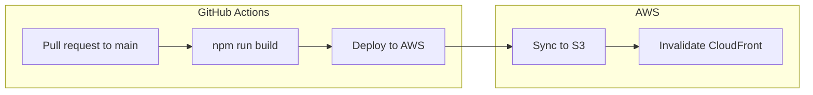

# BearPoints UI - React Frontend

[]()
[]()
[]()
[]()
[]()
[]()

Modern React-based user interface for the BearPoints student recognition system, providing role-based dashboards for students, teachers, paraprofessionals, administrators, and other staff.

**Live Production:** [https://bearpoints.org](https://bearpoints.org)

---

## 🏗️ Architecture Overview



---

## ✨ Features

### 👨‍🏫 Teacher Dashboard

- Classroom leaderboard with timeframe filters (Week/Month/Semester/Year)
- Student management (create, edit, delete classroom rosters)
- Brag log submission and tracking
- QR code generation and bulk printing

### 👩‍🎓 Student Dashboard

- Personal points display with progress bar
- Reward redemption store
- Achievement history (brag logs and redeemed rewards)
- Classroom leaderboard view

### 👔 Admin/Staff Dashboard

- User management (ADMIN, STAFF, PARA users)
- Teacher management (grade level assignment)
- Behavior type configuration (point values, active status)
- Reward Item inventory management
- Manual Google Sheets sync trigger

### 🔓 Public Features

- QR code scanning for brag submission
- Student token-based access

---

## 🚀 Quick Links

| Resource | URL |
|----------|-----|
| Production | https://bearpoints.org |
| API Base URL | https://api.bearpoints.org |

---

## 📦 Technology Stack

| Category | Technology | Version |
|----------|------------|---------|
| Framework | React | 19.0.0 |
| Language | TypeScript | 5.7.2 |
| State Management | Redux Toolkit | 2.8.2 |
| UI Library | React Bootstrap | 2.10.9 |
| Routing | React Router DOM | 7.4.0 |
| HTTP Client | Axios | 1.15.2 |
| Authentication | Firebase Auth | 11.5.0 |
| QR Code | qrcode.react | 4.2.0 |
| Date Handling | date-fns | 4.1.0 |
| Icons | Lucide React | 1.14.0 |
| Build Tool | Vite | 6.2.0 |

---

## 📁 Project Structure

```
ui/
├── src/
│   ├── components/           # Reusable UI components
│   │   ├── behaviorTypes/    # Behavior type CRUD
│   │   ├── bragLogs/         # Brag log forms & tables
│   │   ├── dashboard/        # Dashboard components
│   │   ├── filters/          # Filter components
│   │   ├── leaderboard/      # Leaderboard display
│   │   ├── rewardItems/      # Reward management
│   │   ├── studentRewards/   # Reward redemption
│   │   ├── students/         # Student management
│   │   ├── teachers/         # Teacher management
│   │   └── users/            # User management
│   ├── hooks/                # Custom React hooks
│   │   ├── behaviorType/     # Behavior type hooks
│   │   ├── bragLog/          # Brag log hooks
│   │   ├── dashboard/        # Dashboard hooks
│   │   ├── leaderboard/      # Leaderboard hooks
│   │   ├── rewardItem/       # Reward item hooks
│   │   ├── student/          # Student hooks
│   │   ├── studentReward/    # Student reward hooks
│   │   ├── sync/             # Sync hooks
│   │   ├── teacher/          # Teacher hooks
│   │   └── user/             # User hooks
│   ├── pages/                # Page components
│   ├── services/             # API service layer
│   │   └── api/              # Endpoint-specific services
│   ├── store/                # Redux state management
│   │   └── slices/           # Redux slices
│   ├── types/                # TypeScript type definitions
│   └── utils/                # Utility functions
│       ├── formatters/       # Display formatting
│       ├── sorters/          # Sorting utilities
│       └── validationRules/  # Form validation
├── public/
│   └── bear-mascot.png       # Favicon & mascot
├── Dockerfile                # Multi-stage build
├── nginx.conf               # Nginx configuration
├── package.json
└── README.md
```

---

## 🔐 Authentication Flow



### Role-Based Routing

| Role | Redirect URL |
|------|--------------|
| ADMIN | `/dashboard/admin` |
| STAFF | `/dashboard/admin` |
| TEACHER | `/dashboard/teacher` |
| PARA | `/dashboard/para` |
| STUDENT | `/dashboard/student` |

---

## 🎨 Component Architecture



---

## 🛠️ Local Development

### Prerequisites

- Node.js 22+
- npm 10+ or yarn 1.22+
- Backend API running (local or remote)

### Installation

```bash
# Clone the repository
git clone https://github.com/dmerc12/BearPoints.git
cd BearPoints/ui

# Install dependencies
npm install

# Copy environment template
cp .env.example .env

# Edit .env with your configuration
vim .env

# Start development server
npm run dev
```

### Environment Variables

| Variable | Description | Required |
|----------|-------------|----------|
| `VITE_API_URL` | Backend API URL | Yes |
| `VITE_FIREBASE_API_KEY` | Firebase API key | Yes |
| `VITE_FIREBASE_AUTH_DOMAIN` | Firebase auth domain | Yes |
| `VITE_FIREBASE_PROJECT_ID` | Firebase project ID | Yes |
| `VITE_FIREBASE_STORAGE_BUCKET` | Firebase storage bucket | Yes |
| `VITE_FIREBASE_MESSAGING_SENDER_ID` | Firebase sender ID | Yes |
| `VITE_FIREBASE_APP_ID` | Firebase app ID | Yes |
| `VITE_APP_URL` | Frontend URL for QR codes | Yes |

### Available Scripts

| Script | Description |
|--------|-------------|
| `npm run dev` | Start development server |
| `npm run build` | Build for production |
| `npm run preview` | Preview production build |
| `npm run lint` | Run ESLint |

---

## 🐳 Docker Development

### Development Container

```bash
# Build development image
docker build --target development -t bearpoints-ui-dev .

# Run development container
docker run -p 5173:5173 \
  -e VITE_API_URL=http://localhost:8080 \
  -e VITE_FIREBASE_API_KEY=your-key \
  -e VITE_FIREBASE_AUTH_DOMAIN=auth-domain \
  -e VITE_FIREBASE_PROJECT_ID=project-id \
  -e VITE_FIREBASE_STORAGE_BUCKET=storage-bucket \
  -e VITE_FIREBASE_MESSAGING_SENDER_ID=sender-id \
  -e VITE_FIREBASE_APP_ID=app-id \
  -e VITE_APP_URL=http://localhost:5173 \
  bearpoints-ui-dev
```

### Production Build with Nginx

```bash
# Build production image
docker build --target production -t bearpoints-ui-prod .

# Run production container
docker run -p 80:80 bearpoints-ui-prod
```

### Docker Compose (Full Stack)

```bash
# From project root
docker-compose up -d ui-dev
```

---

## ☁️ AWS Deployment

### S3 + CloudFront Architecture



### Deploy to Production

```bash
# Build with production environment
VITE_API_URL=https://api.bearpoints.org \
VITE_FIREBASE_API_KEY=your-key \
VITE_FIREBASE_AUTH_DOMAIN=auth-domain \
VITE_FIREBASE_PROJECT_ID=project-id \
VITE_FIREBASE_STORAGE_BUCKET=storage-bucket \
VITE_FIREBASE_MESSAGING_SENDER_ID=sender-id \
VITE_FIREBASE_APP_ID=app-id \
VITE_APP_URL=https://bearpoints.org \
npm run build

# Sync to S3
aws s3 sync ./dist/ s3://bearpoints-ui/ --delete

# Invalidate CloudFront cache
aws cloudfront create-invalidation \
  --distribution-id $CLOUDFRONT_DISTRIBUTION_ID \
  --paths "/*"
```

### S3 Bucket Configuration

```json
{
  "Version": "2012-10-17",
  "Statement": [{
    "Effect": "Allow",
    "Principal": "*",
    "Action": "s3:GetObject",
    "Resource": "arn:aws:s3:::bearpoints-ui/*"
  }]
}
```

### CloudFront Settings

| Setting | Value |
|---------|-------|
| Origin | S3 bucket (bearpoints-ui) |
| Viewer Protocol Policy | Redirect HTTP to HTTPS |
| Allowed HTTP Methods | GET, HEAD, OPTIONS |
| Default Root Object | index.html |
| Error Page | 404 → index.html (SPA support) |

### Nginx Configuration (Production Container)

```nginx
server {
    listen 80;
    server_name localhost;
    root /usr/share/nginx/html;
    index index.html;

    location / {
        try_files $uri $uri/ /index.html;
    }

    location ~* \.(js|css|png|jpg|jpeg|gif|ico|svg|woff|woff2)$ {
        expires 1y;
        add_header Cache-Control "public, immutable";
    }

    gzip on;
    gzip_vary on;
    gzip_min_length 1024;
    gzip_types text/plain text/css application/json application/javascript text/xml application/xml;

    add_header X-Frame-Options "SAMEORIGIN" always;
    add_header X-Content-Type-Options "nosniff" always;
    add_header X-XSS-Protection "1; mode=block" always;
}
```

---

## 📱 Key Feature Documentation

### QR Code System



QR code generation:
- Bulk printing from Students page
- Each QR encodes: `https://bearpoints.org/brag?token={studentToken}`
- 3x3 grid layout for printing
- Includes student name, teacher, and grade

### Google Sheets Sync

Sync button appears in Admin/Staff dashboard:



### Leaderboard with Timeframe Filter



---

## 🔧 Configuration Reference

### Vite Configuration

```typescript
// vite.config.ts
export default defineConfig({
  plugins: [react()],
  server: {
    port: 5173,
    proxy: {
      '/api': {
        target: 'http://localhost:8080',
        changeOrigin: true
      }
    }
  }
})
```

### TypeScript Configuration

```json
// tsconfig.app.json
{
  "compilerOptions": {
    "target": "ES2020",
    "lib": ["ES2020", "DOM", "DOM.Iterable"],
    "module": "ESNext",
    "skipLibCheck": true,
    "moduleResolution": "bundler",
    "strict": true,
    "noUnusedLocals": true,
    "noUnusedParameters": true
  }
}
```

---

## 📈 Performance Optimization

### Implemented Optimizations

| Technique | Implementation |
|-----------|----------------|
| Code Splitting | React.lazy() for route-based chunks |
| Caching | CloudFront + S3 with cache headers | 
| Image Optimization | Compressed assets + CDN |
| Bundle Analysis | Vite built-in optimizer |
| Memoization | useMemo, useCallback, lodash.memoize |
| Debouncing | useDebouncedInput for filters |
| Lazy Loading | Route-based chunk loading |

### Lighthouse Targets

| Metric | Target |
|--------|--------|
| First Contentful Paint | <1.5s |
| Time to Interactive | <3.0s |
| Largest Contentful Paint | <2.5s |
| Cumulative Layout Shift | <0.1 |

---

## 🔒 Security

| Control | Implementation | 
|---------|----------------|
| Authentication | Firebase Auth with Google SSO |
| Authorization | Role-based routing + API checks |
| XSS Prevention | React's built-in escaping |
| CORS | Configured on backend |
| Environment Variables | Vite's .env with VITE_ prefix |
| API Tokens | Bearer token via Axios interceptor |

### Axios Request Interceptor

```typescript
api.interceptors.request.use(async (config) => {
  const user = auth.currentUser;
  if (user) {
    const token = await user.getIdToken();
    config.headers.Authorization = `Bearer ${token}`;
  }
  return config;
});
```

---

## 🚢 CI/CD Pipeline



### GitHub Actions Workflow

```yml
- name: Build React app
  run: |
    cd ui
    VITE_API_URL=https://api.bearpoints.org \
    VITE_FIREBASE_API_KEY=${{ secrets.VITE_FIREBASE_API_KEY }} \
    npm run build

- name: Sync to S3
  run: aws s3 sync ./ui/dist/ s3://bearpoints-ui/ --delete

- name: Invalidate CloudFront
  run: aws cloudfront create-invalidation --distribution-id ${{ secrets.CLOUDFRONT_DISTRIBUTION_ID }} --paths "/*"
```

---

## 📚 Additional Documentation

| Document | Location |
|----------|----------|
| Root README | `/README.md` |
| API Documentation | `/api/README.md` |
| Deployment Guide | `/DEPLOYMENT.md` |

---

## 👥 Team

- **Dylan Mercer** - Lead Developer

---

## 📄 License

MIT License

---

**Built with ⚛️ and 🐻 at Buchanan Elementary**
