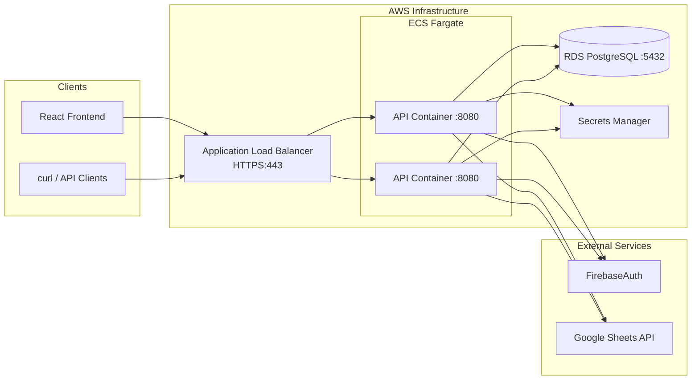
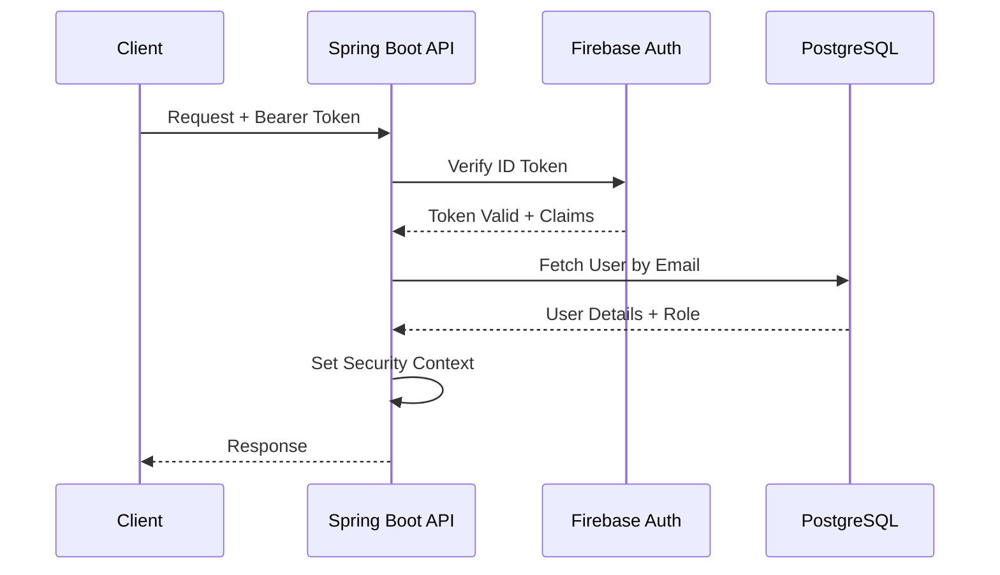
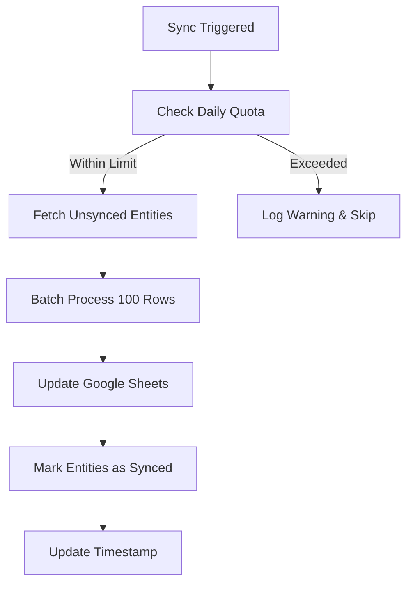

# Bear Points API - Backend Service

[]()
[]()
[]()
[]()
[]()

The backend service for the Bear Points application, providing REST API endpoints for:
- 🔒 Firebase authentication and authorization
- 📝 Brag log management
- 🏆 Leaderboard calculations
- 📊 Google Sheets synchronization
- 🎁 Student reward tracking
- 👥 User and role management

**Production API:** [https://api.bearpoints.org](https://api.bearpoints.org)
**API Documentation:** [https://api.bearpoints.org/swagger-ui.html](https://api.bearpoints.org/swagger-ui.html)

---

## 🏗️ Architecture Overview



---

## 🚀 Quick Links

| Resource | URL |
|----------|-----|
| Production API | https://api.bearpoints.org |
| Swagger UI | https://api.bearpoints.org/swagger-ui.html |
| OpenAPI Spec | https://api.bearpoints.org/api-docs |
| Health Check | https://api.bearpoints.org/actuator/health |

---

## 📦 Technology Stack

| Category | Technology | Version |
|----------|------------|---------|
| Framework | Spring Boot | 3.5.5 |
| Language | Java | 24 |
| Build Tool | Maven | 3.8+ |
| Database | PostgreSQL | 14+ |
| ORM | JPA/Hibernate | - |
| Security | Spring Security + Firebase | - |
| API Docs | SpringDoc OpenAPI | 2.8.13 |
| Testing | JUnit 5 + Testcontainers | - |
| Logging | Log4J2 | - |

---

## 🔧 Configuration

### Environment Variables

| Variable | Description | Required | Default |
|----------|-------------|----------|---------|
| `DB_HOST` | PostgreSQL host | Yes | - |
| `DB_PORT` | PostgreSQL port | Yes | 5432 |
| `DB_NAME` | Database name | Yes | - |
| `DB_USERNAME` | Database username | Yes | - |
| `DB_Password` | Database password | Yes | - |
| `GOOGLE_SERVICE_ACCOUNT_KEY` | Google service account JSON | Yes | - |
| `GOOGLE_SHEET_ID` | Google Sheet ID for sync | Yes | - |
| `FIREBASE_SERVICE_ACCOUNT_KEY` | Firebase service account JSON | Yes | - |
| `FIREBASE_AUTH_DOMAIN` | Firebase authorization domain | Yes | - |
| `PORT` | Server port | No | 8080 |
| `SHOW_SQL` | Show SQL in logs | No | false |

### Service Account Key Format

Both `GOOGLE_SERVICE_ACCOUNT_KEY` and `FIREBASE_SERVICE_ACCOUNT_KEY` expect the exact JSON content as a single-line string:

```json
{"type": "service_account", "project_id": "...", "private_key": "...", ...}
```

#### Important:

- Do not wrap in quotes
- Remove newlines
- Use AWS Secrets Manager in production

---

## 🔐 Authentication & Authorization

### Authentication Flow



### Role-Based Access Control (RBAC)

| Role | Permissions |
|------|-------------|
| ADMIN | Full CRUD on all entities, user management, Google Sheets sync |
| STAFF | Full CRUD on all entities, user management, Google Sheets sync |
| TEACHER | Manage students, submit brag logs, view leaderboards |
| PARA | Submit brag logs, view students |
| STUDENT | Read-only access to own data |

### Security Headers

All responses include:
- `X-Content-Type-Options: nosniff`
- `X-Frame-Options: DENY`
- `X-XSS-Protection: 1; mode=block`

---

## 📡 API Endpoints

### Base URL: `https://api.bearpoints.org/api`

### User Endpoints (`/users`)

| Method | Endpoint | Description | Access | 
|--------|----------|-------------|--------|
| GET | `/users/me` | get current user | Authenticated |
| GET | `/users` | List all users | Authenticated |
| GET | `/users/{id}` | Get user by ID | Authenticated |
| POST | `/users` | Create user | ADMIN, STAFF |
| PUT | `/users/{id}` | Update user | ADMIN, STAFF |
| DELETE | `/users/{id}` | Delete user | ADMIN, STAFF |

### Teacher Endpoints (`/teachers`)

| Method | Endpoint | Description | Access | 
|--------|----------|-------------|--------|
| GET | `/teachers` | List all teachers | Authenticated |
| GET | `/teachers/search` | Search teachers | Authenticated |
| GET | `/teachers/{id}` | Get teacher by ID | Authenticated |
| POST | `/teachers` | Create teacher | ADMIN, STAFF |
| PUT | `/teachers/{id}` | Update teacher | ADMIN, STAFF |
| DELETE | `/teachers/{id}` | Delete teacher | ADMIN, STAFF |

### Student Endpoints (`/students`)

| Method | Endpoint | Description | Access | 
|--------|----------|-------------|--------|
| GET | `/students` | List all students | Authenticated |
| GET | `/students/search` | Search students | Authenticated |
| GET | `/students/leaderboard` | Classroom leaderboard | Authenticated |
| GET | `/students/{id}` | Get student by ID | Authenticated |
| GET | `/students/token/{token}` | Get student by token | Public |
| POST | `/students` | Create student | ADMIN, STAFF, PARA, TEACHER |
| PUT | `/students/{id}` | Update student | ADMIN, STAFF, PARA, TEACHER |
| DELETE | `/students/{id}` | Delete student | ADMIN, STAFF, PARA, TEACHER |

### Behavior Type Endpoints (`/behaviors`)

| Method | Endpoint | Description | Access | 
|--------|----------|-------------|--------|
| GET | `/behaviors` | List all behavior types | Authenticated |
| GET | `/behaviors/search` | Search behavior types | Authenticated |
| GET | `/behaviors/{id}` | Get behavior type by ID | Authenticated |
| POST | `/behaviors` | Create behavior type | ADMIN, STAFF |
| PUT | `/behaviors/{id}` | Update behavior type | ADMIN, STAFF |
| DELETE | `/behaviors/{id}` | Delete behavior type | ADMIN, STAFF |

### Brag Log Endpoints (`/brags`)

| Method | Endpoint | Description | Access | 
|--------|----------|-------------|--------|
| GET | `/brags` | List all brag logs | Authenticated |
| GET | `/brags/search` | Search brag logs | Authenticated |
| GET | `/brags/{id}` | Get brag log by ID | Authenticated |
| POST | `/brags` | Create brag log | Public |
| PUT | `/brags/{id}` | Update brag log | ADMIN, STAFF, TEACHER, PARA |
| DELETE | `/brags/{id}` | Delete brag log | ADMIN, STAFF, TEACHER, PARA |

### Reward Item Endpoints (`/items`)

| Method | Endpoint | Description | Access | 
|--------|----------|-------------|--------|
| GET | `/items` | List all reward items | Authenticated |
| GET | `/items/search` | Search reward items | Authenticated |
| GET | `/items/{id}` | Get reward item by ID | Authenticated |
| POST | `/items` | Create reward item | ADMIN, STAFF |
| PUT | `/items/{id}` | Update reward item | ADMIN, STAFF |
| DELETE | `/items/{id}` | Delete reward item | ADMIN, STAFF |

### Student Reward Endpoints (`/rewards`)

| Method | Endpoint | Description | Access | 
|--------|----------|-------------|--------|
| GET | `/rewards` | List all student rewards | Authenticated |
| GET | `/rewards/search` | Search student rewards | Authenticated |
| GET | `/rewards/{id}` | Get student reward by ID | Authenticated |
| POST | `/rewards` | Create student reward | ADMIN, STAFF, TEACHER, PARA |
| PUT | `/rewards/{id}` | Update student reward | ADMIN, STAFF, TEACHER, PARA |
| DELETE | `/rewards/{id}` | Delete student reward | ADMIN, STAFF, TEACHER, PARA |

### Leaderboard Endpoint (`/leaderboard`)

| Method | Endpoint | Description | Access | 
|--------|----------|-------------|--------|
| GET | `/leaderboard` | Get ranked leaderboard | Authenticated |

#### Query Parameters:

- `timeframe` - WEEK, MONTH, SEMESTER, YEAR (default: WEEK)
- `teacherId` - Filter by teacher (optional)
- `grade` - Filter by grade level (optional)
- `page` - Page number (default: 0)
- `size` - Page size (default: 20)
- `sort` - Sort field and direction (optional)

### Sync Endpoint (`/sync`)

| Method | Endpoint | Description | Access | 
|--------|----------|-------------|--------|
| POST | `/sync` | Trigger Google Sheets sync | ADMIN, STAFF |

---

## 📊 Data Models

### User DTO

```json
{
   "id": 1,
   "email": "teacher@okcps.org",
   "firstName": "John",
   "lastName": "Doe",
   "role": "TEACHER",
   "teacherId": 1,
   "studentId": null
}
```

### Brag Log DTO (Request)

```json
{
   "studentId": 1,
   "behaviors": [1, 2],
   "notes": "Excellent participation today!",
   "submitterName": "Jane Smith"
}
```

### Brag Log DTO (Response)

```json
{
   "id": 1,
   "studentId": 1,
   "studentName": "John Doe",
   "teacherId": 1,
   "teacherName": "Jane Smith",
   "grade": "FIRST",
   "behaviors": [
      {"id": 1, "name": "Participated", "pointValue": 2},
      {"id": 2, "name": "Helped Others", "pointValue": 3}
   ],
   "pointsGenerated": 5,
   "notes": "Excellent participation today!",
   "submitterUserId": 2,
   "submitterName": "Jane Smith",
   "timestamp": "2026-01-15T10:30:00"
}
```

### Paginated Response

```json
{
   "content": [...],
   "totalElements": 100,
   "totalPages": 10,
   "size": 20,
   "number": 0,
   "first": true,
   "last": false,
   "numberOfElements": 20,
   "empty": false
}
```

---

## 🐳 Local Development

### Prerequisites
- Java 24 JDK
- Docker & Docker Compose (for PostgreSQL)
- Maven 3.8+
- Google Cloud service account
- Firebase project

### Quick Start

```bash
# Clone the repository
git clone https://github.com/dmerc12/BearPoints.git
cd BearPoints/api

# Copy environment template
cp example.env.txt .env

# Edit .env with your configuration
vim .env

# Start PostgreSQL with Docker
docker-compose up -d postgres

# Run the application
./mvnw spring-boot:run
```

### Using Maven

```bash
# Run with specific profile
./mvnw spring-boot:run -Dspring-boot.run.profiles=dev

# Package as JAR
./mvnw clean package

# Run the JAR
java -jar target/api-0.0.1-SNAPSHOT.jar
```

### Docker Build

```bash
# Build image
docker build -t bearpoints-api .

# Run container
docker run -p 8080:8080 \
   -e DB_HOST=host.docker.internal \
   -e DB_PORT=5432 \
   -e DB_NAME=bearpoints \
   -e DB_USERNAME=bearpoints \
   -e DB_PASSWORD=bearpoints \
   -e GOOGLE_SERVICE_ACCOUNT_KEY={...} \
   -e GOOGLE_SHEET_ID=sheet-id \
   -e FIREBASE_SERVICE_ACCOUNT_KEY={...} \
   -e FIREBASE_AUTH_DOMAIN=auth-domain \
   bearpoints-api
```

---

## Testing

```bash
# Run all tests
./mvnw test

# Run only unit tests
./mvnw test -Dgroups=unit

# Run only integration tests
./mvnw test -Dgroups=integration

# Run with coverage report
./mvnw clean verify

# View coverage report
open target/site/jacoco/index.html
```

### Test Structure

```
src/test/
├── java/com/bearpoints/api/
│   ├── integration/      # Integration tests with Testcontainers
│   └── unit/             # Unit tests with mocks
└── resources/
    └── application-test.properties
```

---

## 🚢 Deployment (AWS ECS)

### ECS Task Definition

```json
{
  "family": "bearpoints-api",
  "taskRoleArn": "arn:aws:iam::...:role/ecsTaskRole",
  "executionRoleArn": "arn:aws:iam::...:role/ecsExecutionRole",
  "networkMode": "awsvpc",
  "requiresCompatibilities": ["FARGATE"],
  "cpu": "512",
  "memory": "1024",
  "containerDefinitions": [{
    "name": "bearpoints-api",
    "image": "123456789012.dkr.ecr.us-east-2.amazonaws.com/bearpoints-api:latest",
    "portMappings": [{"containerPort": 8080}],
    "environment": [
      {"name": "DB_HOST", "value": "bearpoints.xxxxxx.us-east-2.rds.amazonaws.com"},
      {"name": "DB_PORT", "value": "5432"},
      {"name": "DB_NAME", "value": "bearpoints"},
      {"name": "DB_USERNAME", "value": "bearpoints"},
      {"name": "GOOGLE_SHEET_ID", "value": "your-sheet-id"}
    ],
    "secrets": [
      {"name": "DB_PASSWORD", "valueFrom": "arn:aws:secretsmanager:...:db-password"},
      {"name": "GOOGLE_SERVICE_ACCOUNT_KEY", "valueFrom": "arn:aws:secretsmanager:...:google-key"},
      {"name": "FIREBASE_SERVICE_ACCOUNT_KEY", "valueFrom": "arn:aws:secretsmanager:...:firebase-key"},
      {"name": "FIREBASE_AUTH_DOMAIN", "valueFrom": "arn:aws:secretsmanager:...:firebase-auth-domain"}
    ],
    "logConfiguration": {
      "logDriver": "awslogs",
      "options": {
        "awslogs-group": "/ecs/bearpoints-api",
        "awslogs-region": "us-east-2"
      }
    }
  }]
}
```

### Health Check Configuration

The ALB health check endpoint is `/actuator/health` with expected response:

```json
{"status": "UP"}
```

---

## 📈 Monitoring

### Health Indicators

| Endpoint | Description |
|----------|-------------|
| `/actuator/health` | Overall health (DB, disk space) |
| `/actuator/info` | Application info |

### CloudWatch Metrics

Custom metrics emitted:
- `api.requests.count` - Request count by endpoint
- `api.requests.duration` - Request latency
- `api.sync.duration` - Google Sheets sync duration

### Logging

Logs are sent to CloudWatch Log Group: `/ecs/bearpoints-api`

```bash
# View logs
aws logs tail /ecs/bearpoints-api --follow
```

---

## 🔄  Google Sheets Sync

### Scheduled Sync

- **Time**: Daily at 8:00 AM and 8:00 PM (server time)
- **Scope**: All entity types (Users, Teachers, Students, BehaviorTypes, BragLogs, RewardItems, StudentRewards)
- **Batch Size**: 100 rows per batch
- **Retry**: Exponential backoff (max 3 retries)

### Manual Sync

```bash
curl -X POST https://api.bearpoints.org/api/sync \
   -H "Authorization: Bearer <token>"
```

### Sync Flow



---

## 📝 Error Handling

### HTTP Status Codes

| Code | Description |
|------|-------------|
| 200 | Success |
| 201 | Created |
| 204 | No Content (Delete success) |
| 400 | Bad Request (Validation error) |
| 401 | Unauthorized (Missing/invalid token) |
| 403 | Forbidden (Insufficient role) |
| 404 | Not Found |
| 409 | Conflict (Duplicate resource) |
| 500 | Internal Server Error |

### Error Response Format

```json
{
   "message": "Validation failed",
   "timestamp": "2026-01-15T10:30:00",
   "fieldErrors": {
      "email": "Email must be @okcps.org domain",
      "firstName": "First name is required"
   }
}
```

---

## 🛡️ Security Best Practices

### Production Checklist

- Secrets stored in AWS Secrets Manager (not `.env`)
- Database in private VPC subnet
- SSL/TLS termination at ALB
- CORS restricted to `bearpoints.org`
- Role-based authorization
- Input validation on all endpoints
- SQL injection prevention via JPA
- Regular security updates

### Service Account Permissions

Google Service Account requires:
- Google Sheets API enabled
- Editor access to the sync sheet
Firebase Service Account requires:
- Firebase Admin SDK enabled
- Identity Toolkit API enabled

---

## 📚 Additional Documentation

| Document | Location |
|----------|----------|
| Root README | `/README.md` |
| Frontend Documentation | `/ui/README.md` |
| Deployment Guide | `/DEPLOYMENT.md` |

---

## 👥 Team

- **Dylan Mercer** - Lead Developer

---

## 📄 License

MIT License

---

**Built with ☕ and Spring Boot**
